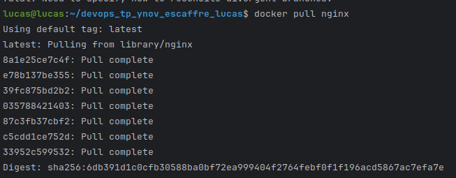
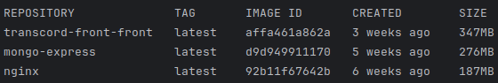
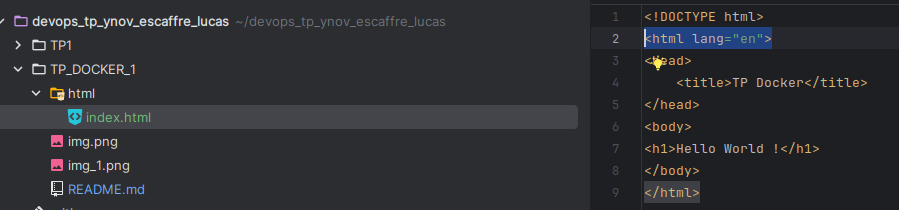
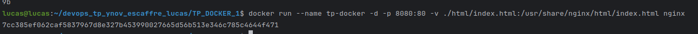
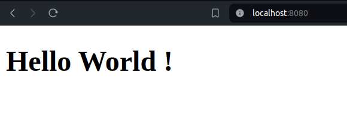
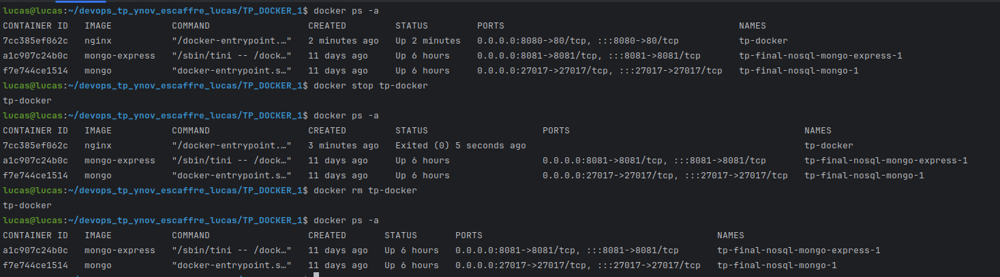
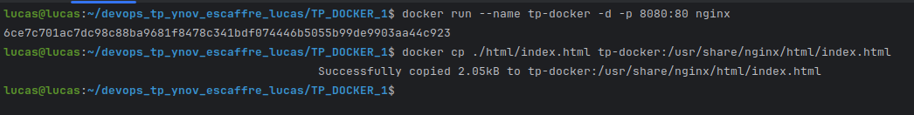
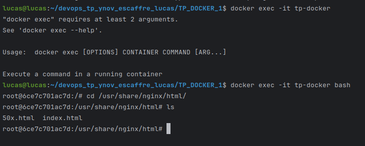
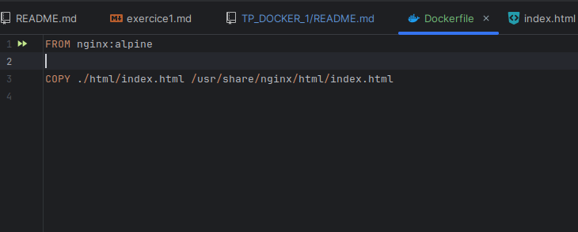
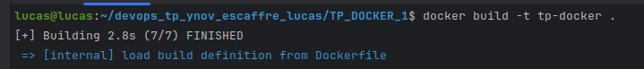

# ESCAFFRE Lucas

## TP Docker

### Executer un serveur web nginx avec docker

#### 1. Récupérer l'image nginx

```bash
docker pull nginx
```



#### 2. Lancer une commande pour vérifier que l'image a bien été téléchargée

```bash
docker images
```



#### 3. Créer un fichier dans le répertoire local .html/ nommé `index.html` contenant le code suivant :

```html
<!DOCTYPE html>
<html lang="en">
<head>
    <title>TP Docker</title>
</head>
<body>
    <h1>Hello World !</h1>
</body>
</html>
```



#### 4.1. Démarrer un nouveau container et servir la page html créée précédemment

```bash
cd TP_DOCKER_1
docker run --name tp-docker -d -p 8080:80 -v ./html/index.html:/usr/share/nginx/html/index.html nginx
```



#### 4.2. Ouvrir un navigateur et accéder à l'adresse `http://localhost:8080`



#### 5. Supprimer le container

Avec le nom du container :
```bash
docker stop tp-docker
docker rm tp-docker
```

Avec l'id du container :
```bash
docker ps -a
docker stop <container_id>
docker rm <container_id>
```

On peut voir que le container a bien été stoppé puis supprimé


#### 6. Relancer le même container sans l'option -v puis utiliser la commande "cp" pour servir votre fichier (docker cp ARGS)

```bash
docker run --name tp-docker -d -p 8080:80 nginx
docker cp ./html/index.html tp-docker:/usr/share/nginx/html/index.html
```



Pour vérifier que cela a fonctionné : 
```bash
docker exec -it tp-docker bash
cat /usr/share/nginx/html/index.html
```




### Builder une image docker

#### 1. Créer un fichier Dockerfile contenant le code suivant pour créer une image qui permet d'éxecuter un serveur web :

```Dockerfile
FROM nginx:latest
COPY ./html/index.html /usr/share/nginx/html/index.html
```



#### 2. Créer une image de manière à servir ./html/index.html

```bash
docker build -t tp-docker .
```

