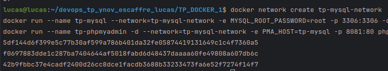

# ESCAFFRE Lucas

## TP Docker

### Executer un serveur web nginx avec docker

#### 1. Récupérer l'image nginx

```bash
docker pull nginx
```


#### 2. Lancer une commande pour vérifier que l'image a bien été téléchargée

```bash
docker images
```


#### 3. Créer un fichier dans le répertoire local .html/ nommé `index.html` contenant le code suivant :

```html
<!DOCTYPE html>
<html lang="en">
<head>
    <title>TP Docker</title>
</head>
<body>
    <h1>Hello World !</h1>
</body>
</html>
```


#### 4.1. Démarrer un nouveau container et servir la page html créée précédemment

```bash
cd TP_DOCKER_1
docker run --name tp-docker -d -p 8080:80 -v ./html/index.html:/usr/share/nginx/html/index.html nginx
```


#### 4.2. Ouvrir un navigateur et accéder à l'adresse `http://localhost:8080`


#### 5. Supprimer le container

Avec le nom du container :
```bash
docker stop tp-docker
docker rm tp-docker
```

Avec l'id du container :
```bash
docker ps -a
docker stop <container_id>
docker rm <container_id>
```

On peut voir que le container a bien été stoppé puis supprimé


#### 6. Relancer le même container sans l'option -v puis utiliser la commande "cp" pour servir votre fichier (docker cp ARGS)

```bash
docker run --name tp-docker -d -p 8080:80 nginx
docker cp ./html/index.html tp-docker:/usr/share/nginx/html/index.html
```


Pour vérifier que cela a fonctionné : 
```bash
docker exec -it tp-docker bash
cat /usr/share/nginx/html/index.html
```


### Builder une image docker

#### 1. Créer un fichier Dockerfile contenant le code suivant pour créer une image qui permet d'éxecuter un serveur web :

```Dockerfile
FROM nginx:latest
COPY ./html/index.html /usr/share/nginx/html/index.html
```


#### 2. Créer une image de manière à servir ./html/index.html

```bash
docker build -t tp-docker .
```


#### 3. Quelles différences voyez-vous entre les deux méthodes ?

Le volume va être réactif, si on modifie dans le pc, cela se répercute directement dans le container alors qu'avec un copy non.


### Utiliser une base de données dans un container docker

#### 1. Récupérer l'image mysql et phpmyadmin/phpmyadmin depuis le docker hub

```bash
docker pull mysql
docker pull phpmyadmin/phpmyadmin
```


#### 2.1. Exécuter 2 containers à partir des images

```bash
docker network create tp-mysql-network
docker run --name tp-mysql -d --network=tp-mysql-network -e MYSQL_ROOT_PASSWORD=root mysql
docker run --name tp-phpmyadmin -d --network=tp-mysql-network -e PMA_HOST=tp-mysql -p 8081:80 phpmyadmin/phpmyadmin
```



#### 2.2. Se connecter à phpmyadmin via l'adresse `http://localhost:8081` avec les identifiants suivants :

- Utilisateur : `root`
- Mot de passe : `root`


#### 3. Créer une base de données nommée `test` et une table `user` : 


### Utiliser docker-compose

#### 1. Décrire à quoi sert la commande `docker-compose` vs `docker run`

`docker-compose` permet de lancer plusieurs containers en même temps, de les lier entre eux et de les configurer. `docker run` permet de lancer un seul container.

#### 2.1. Quelle commande permet de lancer tous les containers décrits dans le fichier `docker-compose.yml` ?

```bash
docker-compose up
```

#### 2.2. Quelle commande permet de stopper tous les containers décrits dans le fichier `docker-compose.yml` ?

```bash
docker-compose down
```

#### 3. Créer un fichier `docker-compose.yml` pour servir la base de données mysql et phpmyadmin

```yml
version: '3.1'

services:
  db:
    image: mysql
    restart: always
    environment:
      MYSQL_ROOT_PASSWORD: root
    networks:
      - tp-mysql-network

  phpmyadmin:
    image: phpmyadmin/phpmyadmin
    restart: always
    environment:
      PMA_HOST: db
    ports:
      - "8081:80"
    networks:
      - tp-mysql-network

networks:
    tp-mysql-network:
        driver: bridge
```