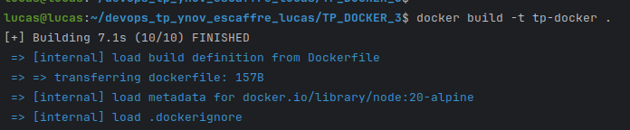
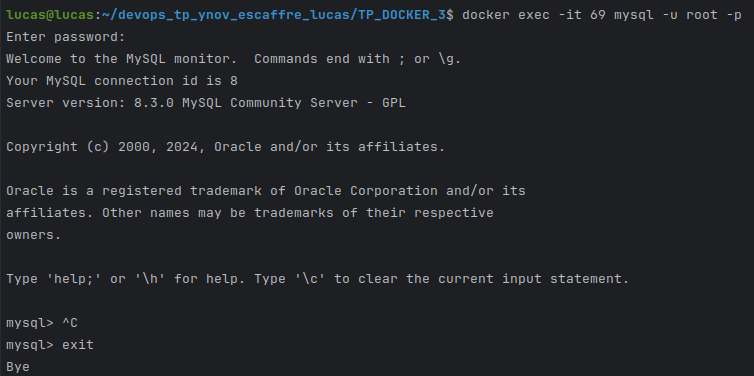

# ESCAFFRE Lucas

## TP Docker 3

### Recuperer le code source de notre api

#### 1. Créer un Dockerfile qui permet de lancer une application nodejs

```Dockerfile
FROM node:20-alpine

WORKDIR /app

COPY ./package.json .

RUN npm install

COPY . .

EXPOSE 3000

CMD ["node", "index.js"]
```

```bash
docker run --name tp-docker -d -p 3000:3000 tp-docker
```



#### 2. Lancer une image de base de donnée mysql

```bash
docker run --name tp-docker-mysql -e MYSQL_ROOT_PASSWORD=root -e MYSQL_DATABASE=tp-docker -d mysql:latest
```



#### 3. Rebuilder votre image docker 

```bash
docker network create tp-mysql-network
docker run --name tp-docker -d --network=tp-mysql-network -p 3000:3000 tp-docker
docker run --name tp-docker-mysql -e MYSQL_ROOT_PASSWORD=root -e MYSQL_DATABASE=tp-docker -d --network=tp-mysql-network mysql:latest
```

