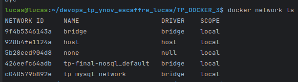
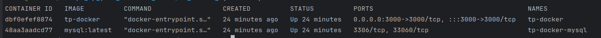
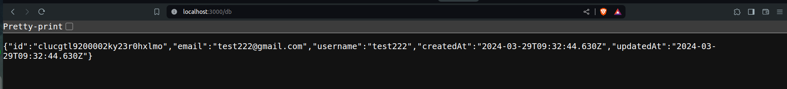

# ESCAFFRE Lucas

## TP Docker 3

### Recuperer le code source de notre api

#### 1. Créer un Dockerfile qui permet de lancer une application nodejs

```Dockerfile
FROM node:20-alpine

WORKDIR /app

COPY ./package.json .

RUN npm install

COPY . .

EXPOSE 3000

CMD ["node", "index.js"]
```

```bash
docker run --name tp-docker -d -p 3000:3000 tp-docker
```


#### 2. Lancer une image de base de donnée mysql

```bash
docker run --name tp-docker-mysql -e MYSQL_ROOT_PASSWORD=root -e MYSQL_DATABASE=tp-docker -d mysql:latest
```


#### 3. Rebuilder votre image docker 

```bash
docker network create tp-mysql-network
docker run --name tp-docker -d --network=tp-mysql-network -p 3000:3000 tp-docker
docker run --name tp-docker-mysql -e MYSQL_ROOT_PASSWORD=root -e MYSQL_DATABASE=tp-docker -d --network=tp-mysql-network mysql:latest
```







#### 4. Créer un docker-compose pour avoir 2 services

```yml
version: '3.1'

services:
  app:
    build: .
    restart: always
    ports:
      - "3000:3000"
    networks:
      - tp-mysql-network
    environment:
      DATABASE_URL: mysql://root:root@db/tp-docker
    depends_on:
      - db

  db:
    image: mysql
    restart: always
    environment:
      MYSQL_ROOT_PASSWORD: root
      MYSQL_DATABASE: tp-docker
    networks:
      - tp-mysql-network

networks:
  tp-mysql-network:
    driver: bridge
```

```bash
docker-compose up
```

### Utiliser des variables d'environnement dans le docker-compose

#### Questions : 

1. Error : Port already in use 
2. --production
3. Parceque l'on est pas en developpement ? 
4. docker scan <nom_image>
5. La db n'est pas en local, on l'a mis dans un container docker donc pour y accéder il faut passer par le nom du container

